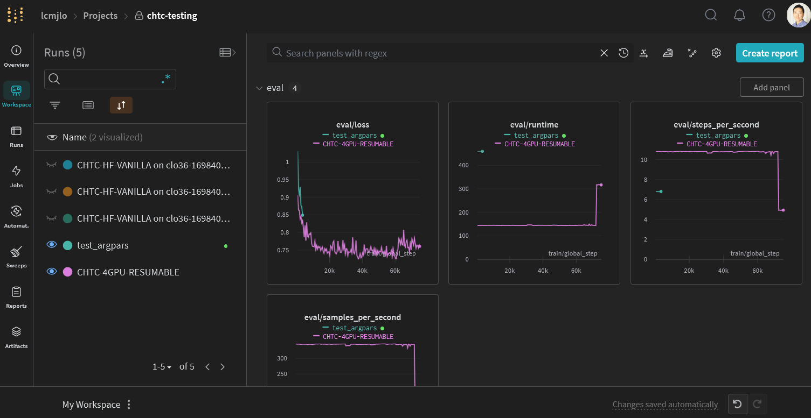

# Personal CHTC Submit Template for LLM Fine-Tuning

Use Case: Fine-tune large language models on CHTC and optionally monitor the process with Weights & Biases. This example is based on the example provided at [Hugging Face Documentation](https://huggingface.co/docs/transformers/training)

## Quick start

1. Store your WANDB credentials and `STAGING_DIR` path in an environment file named .env. See the provided [example](.env.example).
1. Update the `run_name` in `run.sh`. This will be utilized as the WANDB tracking ID, and checkpoints will be saved in `STAGING_DIR/run_name/`.
1. (Optional) Build your own training container, see details below.
1. Modify `run.sub` as necessary.
1. SSH to the submit node.
1. Create a `condor_log` directory using the command: `mkdir condor_log` if you don't have it.
1. Submit your job using `condor_submit run.sub`.

## Building your own container (Optional)

Note: Perform this step on your local machine, not on a CHTC submit node.

Example resources for building a training container:

- [Dockerfile](Dockerfile)
- [requirements.txt](requirements.txt)
- [Helper script](build_push_container.sh)
- [.env](.env.example)

Users should consider building their own container to match their specific needs.

Example Container Image:

- [Link](https://github.com/users/jasonlo/packages/container/package/chtc_condor)

## Used Stacks

- Docker
- Github Container Registry (ghcr.io)
- Huggingface Transformers
- Weights & Biases (WANDB)

## Used CHTC/HTCondor Features

- Docker Universe
- Checkpointing
- Staging (for storing checkpoints)
- GPU

## FAQ

1. Why shouldn't I run python run.py directly in run.sub?

> I need to export the HuggingFace cache directory to _CONDOR_SCRATCH_DIR in a global scope. I'm unaware of a simple method to do this in python. Please let me know if you have a solution.

1. Why is `+GPUJobLength = "short"` present in `run.sub`?

> The queuing duration for `long` is excessive, and since we perform checkpointing, it's more efficient to use `short`. CHTC [policy](https://chtc.cs.wisc.edu/uw-research-computing/gpu-jobs) also allows users to run far more simultaneous `short` jobs than `long` jobs.

1. Can I use additional GPUs?

> Absolutely! Just modify the `request_gpus` value in `run.sub` to your desired number. HuggingFace's [trainer](https://huggingface.co/docs/transformers/main_classes/trainer) will then automatically use all available GPUs.

## To-Do list

- Consolidate all configurations into a single location? They are currently dispersed across `.env`, `run.sh`, and `run.sub`.
- Implement `wandb` hyperparameter `sweep` functionality.
- Integrate `DeepSpeed` support.
- Is it feasible or quicker to store the Docker image in `staging`?
- Experiment with a training-optimized container, such as [NGC](https://catalog.ngc.nvidia.com/orgs/nvidia/containers/pytorch).

## Disclaimer 

Please note that while Weights & Biases is a popular third-party service for logging and visualizing model training, it is not officially supported by CHTC. Though included in this example, its use does not constitute an official endorsement, and users must troubleshoot any W&B issues independently.

## About the author

Contributed by [Jason from Data Science Institute, UW-Madison](https://datascience.wisc.edu/staff/lo-jason/).
