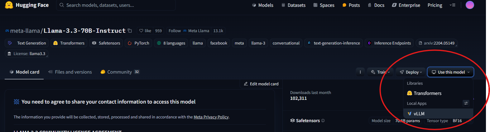

# vLLM Batch Inference on CHTC

This guide demonstrates how to set up, submit, and run batch open-source LLM inference jobs using `vllm` on CHTC via `HTCondor`. This is useful for:

- Generating large volumes of synthetic data using open-source LLMs.
- Conducting large-scale, structured data extraction from text.
- Embedding large volumes of text.
- Running any LLM-driven tasks cost-effectively at a massive scale, without relying on expensive commercial alternatives.

## Prerequisites

- Basic knowledge of CHTC, HTCondor, and Docker universe jobs.

## Introduction

In this example, we will use the [Phi-3.5-mini-instruct](https://huggingface.co/microsoft/Phi-3.5-mini-instruct) model with [vLLM v0.6.4 offline inference](https://docs.vllm.ai/en/v0.6.4/getting_started/examples/offline_inference.html) to process 100 [example inputs](inputs.jsonl). The results will be written to `outputs.jsonl` and transferred back to the submit node using the `transfer_output_files` feature in `HTCondor`.

Example inputs:
```jsonl
{"id": "q0001", "input": "What is the capital of France?"}
{"id": "q0002", "input": "What is the capital of Germany?"}
```

Example outputs:
```jsonl
{"id": "q0001", "input": "What is the capital of France?", "output": "The capital of France is Paris."}
{"id": "q0002", "input": "What is the capital of Germany?", "output": "The capital of Germany is Berlin."}
```

## Step-by-Step Guide

1. Visit [Hugging Face](https://huggingface.co/settings/tokens) and obtain a token for downloading open-source models.
2. `ssh` into a CHTC submit node.
3. Clone this repository: `git clone https://github.com/CHTC/templates-GPUs.git`.
4. Navigate to the example folder: `cd vllm_batch_inference`.
5. Create a `.env` file based on this [example](.env.example).
6. Submit the job: `condor_submit job.sub`.

## FAQ

1. **How to find supported open-source models?**

    Visit [Hugging Face Models](https://huggingface.co/models), select a model, and check if it supports `vllm` by clicking `use this model`. . Note that some models require approval or signing a user agreement on their website.

    <span style="color:red">**Always review the model documentation, as input formats can vary significantly between models.**</span>

2. **Why use `vllm`?**

    `vllm` currently offers the highest throughput for batch offline inference.

3. **Why not use the official `vllm` container?**

    The [official container's](https://hub.docker.com/r/vllm/vllm-openai/tags) entrypoint is set to the API server. I need to change the container entrypoint to `bash`. There may be a way to modify it in the submit file, but I'm unsure how. Please let me know if you have any insights. You can rebuild your version with this [Dockerfile](Dockerfile)

4. **How can I avoid memory issues if I don't need maximum performance?**

    Set `enforce_eager=True` when instantiating `vllm.VLLM` in `batch_inference.py` to mitigate some memory issues. Refer to the [vllm debugging tips](https://docs.vllm.ai/en/stable/getting_started/debugging.html) for more details.

5. **How can I achieve better tokens-per-second performance?**

    Depending on your use case, you may need to tune your model settings in `vllm`, such as `max_tokens`, `max_model_len`, and `batch_size`. Refer to the [vllm debugging tips](https://docs.vllm.ai/en/stable/getting_started/debugging.html) for more details.


## About the Author

Contributed by [Jason from Data Science Institute, UW-Madison](https://github.com/jasonlo).
